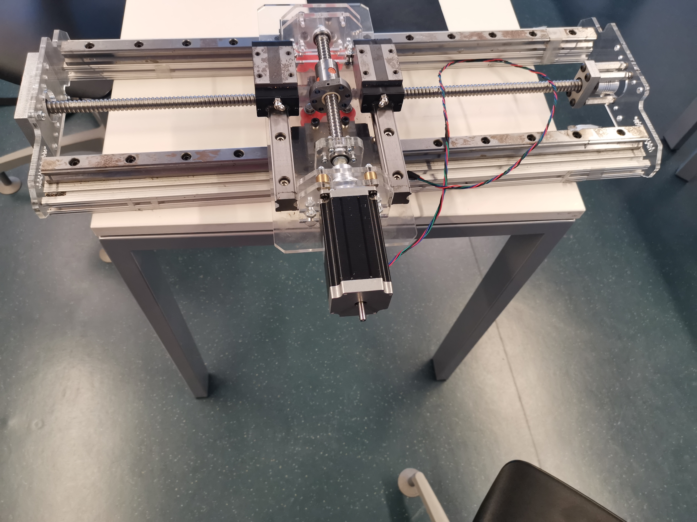

# CNC-Dreiebenk

## Intro
CNC-Dreiebenken er et prosjekt som omhandler å gjøre om de manuelle dreiebenkene her på Kuben. Målet er at de skal kunne styres automatisk ved hjelp av en CNC-modul. Slik som det er i dag må du selv stille inn aksene ved å rotere på et hjul som stiller inn dreieverktøyets posisjon. Modellen skal freses ut her på Kuben, og hvis designet og modellen fungerer er planen å gjøre om alle dreiebenkene her på Kuben. Alle tegninger/sketches må lages av oss ettersom at de som ble brukt for testen er mistet. 

## Fremdriftsplan
1. Lag en sketch for å sjekke om sporene til skinnene passer.
2.	Fres ut sketchen, og gjør endringer ut ifra resultatet. 
3.	Lag sketcher for resten av modellen.
4.	Finn/bestill deler som for eksempel skinner, motorer osv. 
5.	Fres ut alle delene til modellen. 
6.	Sett sammen modellen med motorer og alle platene.
7.	Jobb med software, i henhold til motorer, encodere og drivere. 
8.	Test modellen
